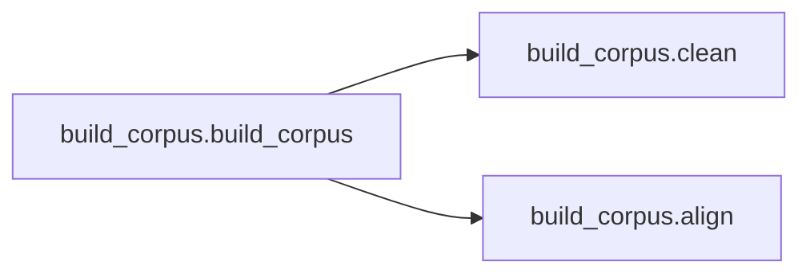
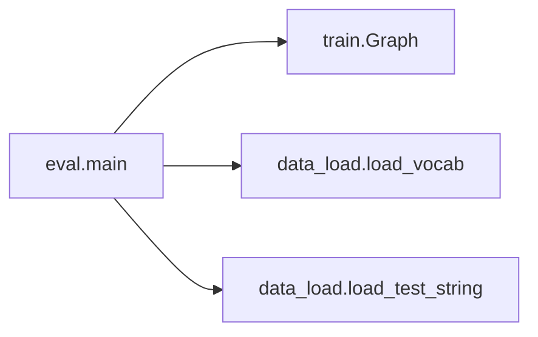
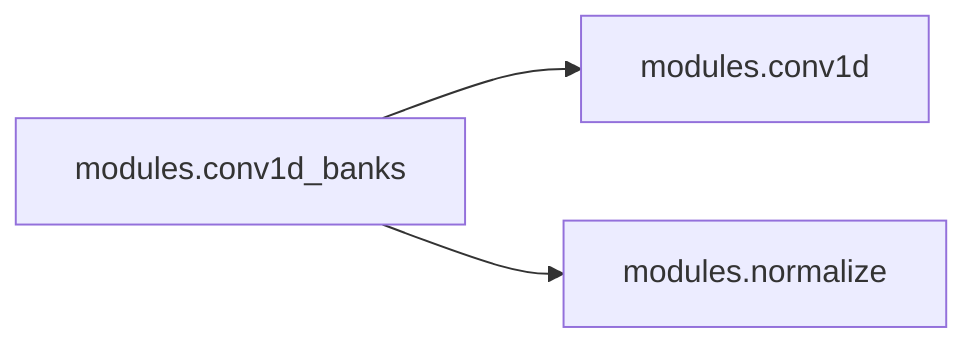
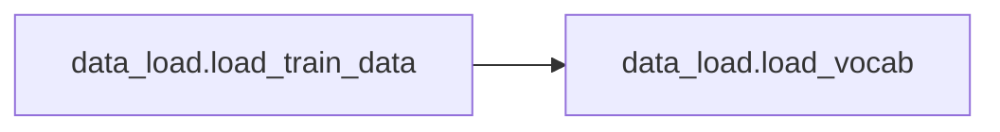
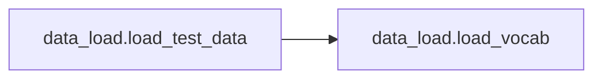
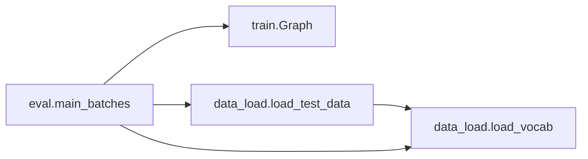
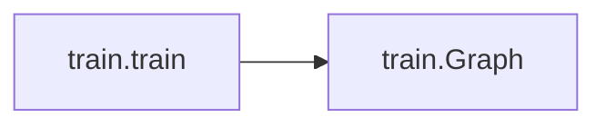
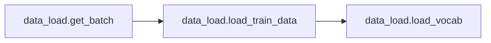

# Key Objects

[_Documentation generated by Documatic_](https://www.documatic.com)

<!---Documatic-section-data_load.load_vocab_json-start--->
## data_load.load_vocab_json

<!---Documatic-section-load_vocab_json-start--->
<!---Documatic-block-data_load.load_vocab_json-start--->
<details>
	<summary><code>data_load.load_vocab_json</code> code snippet</summary>

```python
def load_vocab_json():
    import json
    if hp.isqwerty:
        return json.load(open('data/vocab.qwerty.json', 'r'))
    else:
        return json.load(open('data/vocab.nine.json', 'r'))
```
</details>
<!---Documatic-block-data_load.load_vocab_json-end--->
<!---Documatic-section-load_vocab_json-end--->

# #
<!---Documatic-section-data_load.load_vocab_json-end--->

<!---Documatic-section-build_corpus.clean-start--->
## build_corpus.clean

<!---Documatic-section-clean-start--->
<!---Documatic-block-build_corpus.clean-start--->
<details>
	<summary><code>build_corpus.clean</code> code snippet</summary>

```python
def clean(text):
    if regex.search('[A-Za-z0-9]', text) is not None:
        return ''
    text = regex.sub(u'[^ \\p{Han}。，！？]', '', text)
    return text
```
</details>
<!---Documatic-block-build_corpus.clean-end--->
<!---Documatic-section-clean-end--->

# #
<!---Documatic-section-build_corpus.clean-end--->

<!---Documatic-section-build_corpus.build_corpus-start--->
## build_corpus.build_corpus

<!---Documatic-section-build_corpus-start--->


### Object Calls

* build_corpus.clean
* build_corpus.align

<!---Documatic-block-build_corpus.build_corpus-start--->
<details>
	<summary><code>build_corpus.build_corpus</code> code snippet</summary>

```python
def build_corpus():
    with codecs.open('data/zh.tsv', 'w', 'utf-8') as fout:
        with codecs.open('data/zho_news_2007-2009_1M-sentences.txt', 'r', 'utf-8') as fin:
            i = 1
            while 1:
                line = fin.readline()
                if not line:
                    break
                try:
                    (idx, sent) = line.strip().split('\t')
                    sent = clean(sent)
                    if len(sent) > 0:
                        (pnyns, hanzis) = align(sent)
                        fout.write(u'{}\t{}\t{}\n'.format(idx, pnyns, hanzis))
                except:
                    continue
                if i % 10000 == 0:
                    print(i)
                i += 1
```
</details>
<!---Documatic-block-build_corpus.build_corpus-end--->
<!---Documatic-section-build_corpus-end--->

# #
<!---Documatic-section-build_corpus.build_corpus-end--->

<!---Documatic-section-eval.main-start--->
## eval.main

<!---Documatic-section-main-start--->


### Object Calls

* train.Graph
* data_load.load_vocab
* data_load.load_test_string

<!---Documatic-block-eval.main-start--->
<details>
	<summary><code>eval.main</code> code snippet</summary>

```python
def main():
    g = Graph(is_training=False)
    (pnyn2idx, idx2pnyn, hanzi2idx, idx2hanzi) = load_vocab()
    with g.graph.as_default():
        sv = tf.train.Supervisor()
        with sv.managed_session(config=tf.ConfigProto(allow_soft_placement=True)) as sess:
            sv.saver.restore(sess, tf.train.latest_checkpoint(hp.logdir))
            print('Restored!')
            mname = open(hp.logdir + '/checkpoint', 'r').read().split('"')[1]
            while True:
                line = input('请输入测试拼音：')
                if len(line) > hp.maxlen:
                    print('最长拼音不能超过50')
                    continue
                x = load_test_string(pnyn2idx, line)
                preds = sess.run(g.preds, {g.x: x})
                got = ''.join((idx2hanzi[idx] for idx in preds[0]))[:np.count_nonzero(x[0])].replace('_', '')
                print(got)
```
</details>
<!---Documatic-block-eval.main-end--->
<!---Documatic-section-main-end--->

# #
<!---Documatic-section-eval.main-end--->

<!---Documatic-section-data_load.load_vocab-start--->
## data_load.load_vocab

<!---Documatic-section-load_vocab-start--->
<!---Documatic-block-data_load.load_vocab-start--->
<details>
	<summary><code>data_load.load_vocab</code> code snippet</summary>

```python
def load_vocab():
    import pickle
    if hp.isqwerty:
        return pickle.load(open('data/vocab.qwerty.pkl', 'rb'))
    else:
        return pickle.load(open('data/vocab.nine.pkl', 'rb'))
```
</details>
<!---Documatic-block-data_load.load_vocab-end--->
<!---Documatic-section-load_vocab-end--->

# #
<!---Documatic-section-data_load.load_vocab-end--->

<!---Documatic-section-modules.conv1d_banks-start--->
## modules.conv1d_banks

<!---Documatic-section-conv1d_banks-start--->


### Object Calls

* modules.conv1d
* modules.normalize

<!---Documatic-block-modules.conv1d_banks-start--->
<details>
	<summary><code>modules.conv1d_banks</code> code snippet</summary>

```python
def conv1d_banks(inputs, num_units=None, K=16, is_training=True, scope='conv1d_banks', reuse=None):
    with tf.variable_scope(scope, reuse=reuse):
        if num_units is None:
            num_units = hp.embed_size // 2
        outputs = conv1d(inputs, hp.embed_size // 2, 1)
        for k in range(2, K + 1):
            with tf.variable_scope('num_{}'.format(k)):
                output = conv1d(inputs, num_units, k)
                outputs = tf.concat((outputs, output), -1)
        outputs = normalize(outputs, type=hp.norm_type, is_training=is_training, activation_fn=tf.nn.relu)
    return outputs
```
</details>
<!---Documatic-block-modules.conv1d_banks-end--->
<!---Documatic-section-conv1d_banks-end--->

# #
<!---Documatic-section-modules.conv1d_banks-end--->

<!---Documatic-section-modules.highwaynet-start--->
## modules.highwaynet

<!---Documatic-section-highwaynet-start--->
<!---Documatic-block-modules.highwaynet-start--->
<details>
	<summary><code>modules.highwaynet</code> code snippet</summary>

```python
def highwaynet(inputs, num_units=None, scope='highwaynet', reuse=None):
    if not num_units:
        num_units = inputs.get_shape()[-1]
    with tf.variable_scope(scope, reuse=reuse):
        H = tf.layers.dense(inputs, units=num_units, activation=tf.nn.relu, name='dense1')
        T = tf.layers.dense(inputs, units=num_units, activation=tf.nn.sigmoid, bias_initializer=tf.constant_initializer(-1.0), name='dense2')
        C = 1.0 - T
        outputs = H * T + inputs * C
    return outputs
```
</details>
<!---Documatic-block-modules.highwaynet-end--->
<!---Documatic-section-highwaynet-end--->

# #
<!---Documatic-section-modules.highwaynet-end--->

<!---Documatic-section-modules.prenet-start--->
## modules.prenet

<!---Documatic-section-prenet-start--->
<!---Documatic-block-modules.prenet-start--->
<details>
	<summary><code>modules.prenet</code> code snippet</summary>

```python
def prenet(inputs, num_units=None, is_training=True, scope='prenet', reuse=None):
    if num_units is None:
        num_units = [hp.embed_size, hp.embed_size // 2]
    with tf.variable_scope(scope, reuse=reuse):
        outputs = tf.layers.dense(inputs, units=num_units[0], activation=tf.nn.relu, name='dense1')
        outputs = tf.layers.dropout(outputs, rate=hp.dropout_rate, training=is_training, name='dropout1')
        outputs = tf.layers.dense(outputs, units=num_units[1], activation=tf.nn.relu, name='dense2')
        outputs = tf.layers.dropout(outputs, rate=hp.dropout_rate, training=is_training, name='dropout2')
    return outputs
```
</details>
<!---Documatic-block-modules.prenet-end--->
<!---Documatic-section-prenet-end--->

# #
<!---Documatic-section-modules.prenet-end--->

<!---Documatic-section-modules.conv1d-start--->
## modules.conv1d

<!---Documatic-section-conv1d-start--->
<!---Documatic-block-modules.conv1d-start--->
<details>
	<summary><code>modules.conv1d</code> code snippet</summary>

```python
def conv1d(inputs, filters=None, size=1, rate=1, padding='SAME', use_bias=False, activation_fn=None, scope='conv1d', reuse=None):
    with tf.variable_scope(scope):
        if padding.lower() == 'causal':
            pad_len = (size - 1) * rate
            inputs = tf.pad(inputs, [[0, 0], [pad_len, 0], [0, 0]])
            padding = 'valid'
        if filters is None:
            filters = inputs.get_shape().as_list[-1]
        params = {'inputs': inputs, 'filters': filters, 'kernel_size': size, 'dilation_rate': rate, 'padding': padding, 'activation': activation_fn, 'use_bias': use_bias, 'reuse': reuse}
        outputs = tf.layers.conv1d(**params)
    return outputs
```
</details>
<!---Documatic-block-modules.conv1d-end--->
<!---Documatic-section-conv1d-end--->

# #
<!---Documatic-section-modules.conv1d-end--->

<!---Documatic-section-modules.gru-start--->
## modules.gru

<!---Documatic-section-gru-start--->
<!---Documatic-block-modules.gru-start--->
<details>
	<summary><code>modules.gru</code> code snippet</summary>

```python
def gru(inputs, num_units=None, bidirection=False, seqlen=None, scope='gru', reuse=None):
    with tf.variable_scope(scope, reuse=reuse):
        if num_units is None:
            num_units = inputs.get_shape().as_list[-1]
        cell = tf.contrib.rnn.GRUCell(num_units)
        if bidirection:
            cell_bw = tf.contrib.rnn.GRUCell(num_units)
            (outputs, _) = tf.nn.bidirectional_dynamic_rnn(cell, cell_bw, inputs, sequence_length=seqlen, dtype=tf.float32)
            return tf.concat(outputs, 2)
        else:
            (outputs, _) = tf.nn.dynamic_rnn(cell, inputs, sequence_length=seqlen, dtype=tf.float32)
    return outputs
```
</details>
<!---Documatic-block-modules.gru-end--->
<!---Documatic-section-gru-end--->

# #
<!---Documatic-section-modules.gru-end--->

<!---Documatic-section-modules.normalize-start--->
## modules.normalize

<!---Documatic-section-normalize-start--->
<!---Documatic-block-modules.normalize-start--->
<details>
	<summary><code>modules.normalize</code> code snippet</summary>

```python
def normalize(inputs, type='bn', decay=0.99, epsilon=1e-08, is_training=True, activation_fn=None, reuse=None, scope='normalize'):
    if type == 'bn':
        inputs_shape = inputs.get_shape()
        inputs_rank = inputs_shape.ndims
        if inputs_rank in [2, 3, 4]:
            if inputs_rank == 2:
                inputs = tf.expand_dims(inputs, axis=1)
                inputs = tf.expand_dims(inputs, axis=2)
            elif inputs_rank == 3:
                inputs = tf.expand_dims(inputs, axis=1)
            outputs = tf.contrib.layers.batch_norm(inputs=inputs, decay=decay, center=True, scale=True, updates_collections=None, is_training=is_training, scope=scope, zero_debias_moving_mean=True, fused=True, reuse=reuse)
            if inputs_rank == 2:
                outputs = tf.squeeze(outputs, axis=[1, 2])
            elif inputs_rank == 3:
                outputs = tf.squeeze(outputs, axis=1)
        else:
            outputs = tf.contrib.layers.batch_norm(inputs=inputs, decay=decay, center=True, scale=True, updates_collections=None, is_training=is_training, scope=scope, reuse=reuse, fused=False)
    elif type in ('ln', 'ins'):
        reduction_axis = -1 if type == 'ln' else 1
        with tf.variable_scope(scope, reuse=reuse):
            inputs_shape = inputs.get_shape()
            params_shape = inputs_shape[-1:]
            (mean, variance) = tf.nn.moments(inputs, [reduction_axis], keep_dims=True)
            beta = tf.Variable(tf.zeros(params_shape))
            gamma = tf.Variable(tf.ones(params_shape))
            normalized = (inputs - mean) / (variance + epsilon) ** 0.5
            outputs = gamma * normalized + beta
    else:
        outputs = inputs
    if activation_fn:
        outputs = activation_fn(outputs)
    return outputs
```
</details>
<!---Documatic-block-modules.normalize-end--->
<!---Documatic-section-normalize-end--->

# #
<!---Documatic-section-modules.normalize-end--->

<!---Documatic-section-prepro.build_vocab-start--->
## prepro.build_vocab

<!---Documatic-section-build_vocab-start--->
<!---Documatic-block-prepro.build_vocab-start--->
<details>
	<summary><code>prepro.build_vocab</code> code snippet</summary>

```python
def build_vocab():
    from collections import Counter
    from itertools import chain
    if hp.isqwerty:
        pnyns = 'EUabcdefghijklmnopqrstuvwxyz0123456789。，！？'
        pnyn2idx = {pnyn: idx for (idx, pnyn) in enumerate(pnyns)}
        idx2pnyn = {idx: pnyn for (idx, pnyn) in enumerate(pnyns)}
    else:
        (pnyn2idx, idx2pnyn) = (dict(), dict())
        pnyns_list = ['E', 'U', 'abc', 'def', 'ghi', 'jkl', 'mno', 'pqrs', 'tuv', 'wxyz', '0', '1', '2', '3', '4', '5', '6', '7', '8', '9', u'。', u'，', u'！', u'？']
        for (i, pnyns) in enumerate(pnyns_list):
            for pnyn in pnyns:
                pnyn2idx[pnyn] = i
    hanzi_sents = [line.split('\t')[2] for line in codecs.open('data/zh.tsv', 'r', 'utf-8').read().splitlines()]
    hanzi2cnt = Counter(chain.from_iterable(hanzi_sents))
    hanzis = [hanzi for (hanzi, cnt) in hanzi2cnt.items() if cnt > 5]
    hanzis.remove('_')
    hanzis = ['E', 'U', '_'] + hanzis
    hanzi2idx = {hanzi: idx for (idx, hanzi) in enumerate(hanzis)}
    idx2hanzi = {idx: hanzi for (idx, hanzi) in enumerate(hanzis)}
    if hp.isqwerty:
        json.dump((pnyn2idx, idx2pnyn, hanzi2idx, idx2hanzi), open('data/vocab.qwerty.json', 'w'))
    else:
        json.dump((pnyn2idx, idx2pnyn, hanzi2idx, idx2hanzi), open('data/vocab.nine.json', 'w'))
```
</details>
<!---Documatic-block-prepro.build_vocab-end--->
<!---Documatic-section-build_vocab-end--->

# #
<!---Documatic-section-prepro.build_vocab-end--->

<!---Documatic-section-modules.embed-start--->
## modules.embed

<!---Documatic-section-embed-start--->
<!---Documatic-block-modules.embed-start--->
<details>
	<summary><code>modules.embed</code> code snippet</summary>

```python
def embed(inputs, vocab_size, num_units, zero_pad=True, scope='embedding', reuse=None):
    with tf.variable_scope(scope, reuse=reuse):
        lookup_table = tf.get_variable('lookup_table', dtype=tf.float32, shape=[vocab_size, num_units], initializer=tf.truncated_normal_initializer(mean=0.0, stddev=0.01))
        if zero_pad:
            lookup_table = tf.concat((tf.zeros(shape=[1, num_units]), lookup_table[1:, :]), 0)
    return tf.nn.embedding_lookup(lookup_table, inputs)
```
</details>
<!---Documatic-block-modules.embed-end--->
<!---Documatic-section-embed-end--->

# #
<!---Documatic-section-modules.embed-end--->

<!---Documatic-section-data_load.load_test_string-start--->
## data_load.load_test_string

<!---Documatic-section-load_test_string-start--->
<!---Documatic-block-data_load.load_test_string-start--->
<details>
	<summary><code>data_load.load_test_string</code> code snippet</summary>

```python
def load_test_string(pnyn2idx, test_string):
    pnyn_sent = test_string
    xs = []
    x = [pnyn2idx.get(pnyn, 1) for pnyn in pnyn_sent]
    x += [0] * (hp.maxlen - len(x))
    xs.append(x)
    X = np.array(xs, np.int32)
    return X
```
</details>
<!---Documatic-block-data_load.load_test_string-end--->
<!---Documatic-section-load_test_string-end--->

# #
<!---Documatic-section-data_load.load_test_string-end--->

<!---Documatic-section-data_load.load_train_data-start--->
## data_load.load_train_data

<!---Documatic-section-load_train_data-start--->


### Object Calls

* data_load.load_vocab

<!---Documatic-block-data_load.load_train_data-start--->
<details>
	<summary><code>data_load.load_train_data</code> code snippet</summary>

```python
def load_train_data():
    (pnyn2idx, idx2pnyn, hanzi2idx, idx2hanzi) = load_vocab()
    print('pnyn vocabulary size is', len(pnyn2idx))
    print('hanzi vocabulary size is', len(hanzi2idx))
    (xs, ys) = ([], [])
    with codecs.open('t', 'w', 'utf-8') as fout:
        for line in codecs.open('data/zh.tsv', 'r', 'utf-8'):
            try:
                (_, pnyn_sent, hanzi_sent) = line.strip().split('\t')
            except ValueError:
                continue
            pnyn_sents = re.sub(u'(?<=([。，！？]))', '|', pnyn_sent).split('|')
            hanzi_sents = re.sub(u'(?<=([。，！？]))', '|', hanzi_sent).split('|')
            fout.write(pnyn_sent + '===' + '|'.join(pnyn_sents) + '\n')
            for (pnyn_sent, hanzi_sent) in zip(pnyn_sents + [pnyn_sent], hanzi_sents + [hanzi_sent]):
                assert len(pnyn_sent) == len(hanzi_sent)
                if hp.minlen < len(pnyn_sent) <= hp.maxlen:
                    x = [pnyn2idx.get(pnyn, 1) for pnyn in pnyn_sent]
                    y = [hanzi2idx.get(hanzi, 1) for hanzi in hanzi_sent]
                    xs.append(np.array(x, np.int32).tostring())
                    ys.append(np.array(y, np.int32).tostring())
    return (xs, ys)
```
</details>
<!---Documatic-block-data_load.load_train_data-end--->
<!---Documatic-section-load_train_data-end--->

# #
<!---Documatic-section-data_load.load_train_data-end--->

<!---Documatic-section-data_load.load_test_data-start--->
## data_load.load_test_data

<!---Documatic-section-load_test_data-start--->


### Object Calls

* data_load.load_vocab

<!---Documatic-block-data_load.load_test_data-start--->
<details>
	<summary><code>data_load.load_test_data</code> code snippet</summary>

```python
def load_test_data():
    try:
        lines = [line for line in codecs.open('eval/input.csv', 'r', 'utf-8').read().splitlines()[1:]]
    except IOError:
        raise IOError('Write the sentences you want to test line by line in `data/input.csv` file.')
    (pnyn2idx, _, hanzi2idx, _) = load_vocab()
    (nums, xs, ys) = ([], [], [])
    for line in lines:
        (num, pnyn_sent, y) = line.split(',')
        nums.append(num)
        x = [pnyn2idx.get(pnyn, 1) for pnyn in pnyn_sent]
        x += [0] * (hp.maxlen - len(x))
        xs.append(x)
        ys.append(y)
    X = np.array(xs, np.int32)
    return (nums, X, ys)
```
</details>
<!---Documatic-block-data_load.load_test_data-end--->
<!---Documatic-section-load_test_data-end--->

# #
<!---Documatic-section-data_load.load_test_data-end--->

<!---Documatic-section-build_corpus.align-start--->
## build_corpus.align

<!---Documatic-section-align-start--->
<!---Documatic-block-build_corpus.align-start--->
<details>
	<summary><code>build_corpus.align</code> code snippet</summary>

```python
def align(sent):
    pinyin = Pinyin()
    pnyns = pinyin.get_pinyin(sent, ' ').split()
    hanzis = []
    for (char, p) in zip(sent.replace(' ', ''), pnyns):
        hanzis.extend([char] + ['_'] * (len(p) - 1))
    pnyns = ''.join(pnyns)
    hanzis = ''.join(hanzis)
    assert len(pnyns) == len(hanzis), 'The hanzis and the pinyins must be the same in length.'
    return (pnyns, hanzis)
```
</details>
<!---Documatic-block-build_corpus.align-end--->
<!---Documatic-section-align-end--->

# #
<!---Documatic-section-build_corpus.align-end--->

<!---Documatic-section-eval.main_batches-start--->
## eval.main_batches

<!---Documatic-section-main_batches-start--->


### Object Calls

* train.Graph
* data_load.load_test_data
* data_load.load_vocab

<!---Documatic-block-eval.main_batches-start--->
<details>
	<summary><code>eval.main_batches</code> code snippet</summary>

```python
def main_batches():
    g = Graph(is_training=False)
    (nums, X, ys) = load_test_data()
    (pnyn2idx, idx2pnyn, hanzi2idx, idx2hanzi) = load_vocab()
    with g.graph.as_default():
        sv = tf.train.Supervisor()
        with sv.managed_session(config=tf.ConfigProto(allow_soft_placement=True)) as sess:
            sv.saver.restore(sess, tf.train.latest_checkpoint(hp.logdir))
            print('Restored!')
            mname = open(hp.logdir + '/checkpoint', 'r').read().split('"')[1]
            with codecs.open('eval/{}_{}.csv'.format(mname, 'qwerty' if hp.isqwerty else 'nine'), 'w', 'utf-8') as fout:
                fout.write('NUM,EXPECTED,{}_{},# characters,edit distance\n'.format(mname, 'qwerty' if hp.isqwerty else 'nine'))
                (total_edit_distance, num_chars) = (0, 0)
                for step in range(len(X) // hp.batch_size):
                    num = nums[step * hp.batch_size:(step + 1) * hp.batch_size]
                    x = X[step * hp.batch_size:(step + 1) * hp.batch_size]
                    y = ys[step * hp.batch_size:(step + 1) * hp.batch_size]
                    preds = sess.run(g.preds, {g.x: x})
                    for (n, xx, pred, expected) in zip(num, x, preds, y):
                        got = ''.join((idx2hanzi[idx] for idx in pred))[:np.count_nonzero(xx)].replace('_', '')
                        edit_distance = distance.levenshtein(expected, got)
                        total_edit_distance += edit_distance
                        num_chars += len(expected)
                        fout.write(u'{},{},{},{},{}\n'.format(n, expected, got, len(expected), edit_distance))
                fout.write(u'Total CER: {}/{}={},,,,\n'.format(total_edit_distance, num_chars, round(float(total_edit_distance) / num_chars, 2)))
```
</details>
<!---Documatic-block-eval.main_batches-end--->
<!---Documatic-section-main_batches-end--->

# #
<!---Documatic-section-eval.main_batches-end--->

<!---Documatic-section-train.train-start--->
## train.train

<!---Documatic-section-train-start--->


### Object Calls

* train.Graph

<!---Documatic-block-train.train-start--->
<details>
	<summary><code>train.train</code> code snippet</summary>

```python
def train():
    g = Graph()
    print('Training Graph loaded')
    with g.graph.as_default():
        sv = tf.train.Supervisor(logdir=hp.logdir, save_model_secs=0)
        with sv.managed_session() as sess:
            for epoch in range(1, hp.num_epochs + 1):
                if sv.should_stop():
                    break
                for step in tqdm(range(g.num_batch), total=g.num_batch, ncols=70, leave=False, unit='b'):
                    sess.run(g.train_op)
                gs = sess.run(g.global_step)
                sv.saver.save(sess, hp.logdir + '/model_epoch_%02d_gs_%d' % (epoch, gs))
```
</details>
<!---Documatic-block-train.train-end--->
<!---Documatic-section-train-end--->

# #
<!---Documatic-section-train.train-end--->

<!---Documatic-section-data_load.get_batch-start--->
## data_load.get_batch

<!---Documatic-section-get_batch-start--->


### Object Calls

* data_load.load_train_data

<!---Documatic-block-data_load.get_batch-start--->
<details>
	<summary><code>data_load.get_batch</code> code snippet</summary>

```python
def get_batch():
    import tensorflow as tf
    (X, Y) = load_train_data()
    (x, y) = tf.train.slice_input_producer([tf.convert_to_tensor(X), tf.convert_to_tensor(Y)])
    x = tf.decode_raw(x, tf.int32)
    y = tf.decode_raw(y, tf.int32)
    (x, y) = tf.train.batch([x, y], shapes=[(None,), (None,)], num_threads=8, batch_size=hp.batch_size, capacity=hp.batch_size * 64, allow_smaller_final_batch=False, dynamic_pad=True)
    num_batch = len(X) // hp.batch_size
    return (x, y, num_batch)
```
</details>
<!---Documatic-block-data_load.get_batch-end--->
<!---Documatic-section-get_batch-end--->

# #
<!---Documatic-section-data_load.get_batch-end--->

[_Documentation generated by Documatic_](https://www.documatic.com)